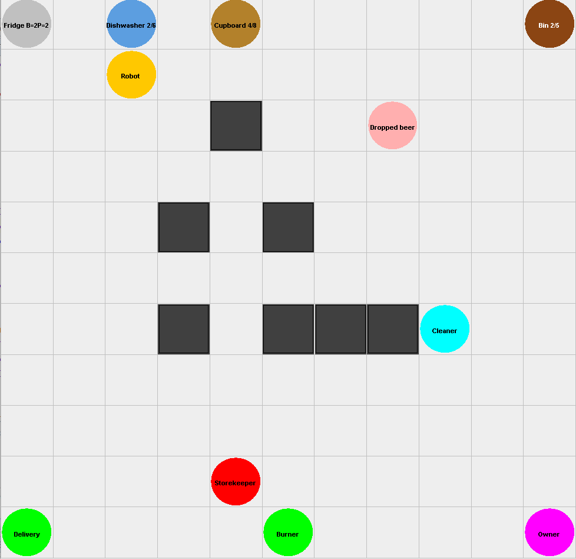

# Memoria Robot Doméstico - Entrega final

> Hecho por:
> 
> Javier Veloso Boubeta
> 
> Cristian Sousa Vidal
> 
> Mario Vila Comesaña

- [Memoria Robot Doméstico - Entrega final](#memoria-robot-doméstico---entrega-final)
  - [Elementos participantes del proyecto](#elementos-participantes-del-proyecto)
    - [Zonas](#zonas)
    - [Agentes](#agentes)
      - [Owner](#owner)
      - [Supermercado](#supermercado)
      - [Robot mayordomo](#robot-mayordomo)
      - [Cleaner](#cleaner)
      - [Burner](#burner)
      - [Storekeeper](#storekeeper)
  - [Movimiento de Agentes](#movimiento-de-agentes)
    - [Funciones de coste y heurística](#funciones-de-coste-y-heurística)
    - [¿Por qué A\*?](#por-qué-a)
    - [Uso de las directivas *up*,*down*,*left*,*right*](#uso-de-las-directivas-updownleftright)
  - [Percepts](#percepts)
    - [Movimiento](#movimiento)
    - [Basura](#basura)
    - [Nevera](#nevera)
    - [has(owner,beer)](#hasownerbeer)
    - [Lavavajillas](#lavavajillas)
    - [Alacena](#alacena)
    - [Proveedor](#proveedor)
  - [Universalidad de la solución](#universalidad-de-la-solución)
    - [Agentes móbiles y robots](#agentes-móbiles-y-robots)
    - [Zonas](#zonas-1)
    - [Supermercados](#supermercados)
    - [Entorno](#entorno)


## Elementos participantes del proyecto
  ### Zonas
- **Papelera**: Almacena toda la basura generada por un Owner. Esta cuenta con una capacidad de 5 latas, y una vez que se llene, se vaciará gracias al robot Burner.
- **Delivery**: En esta zona, el StoreKeeper decide a qué supermercado comprarle los productos. Para decidir en que supermercado se hace la compra, el robot StoreKeeper tiene en cuenta cual es la marca favorita, cual es el precio más barato y si hay suficiente stock de ese producto. Si no hubiese suficiente cantidad, comprará las unidades restantes en otro Supermecado. Una vez recibidos los productos, el robot los recoge y los deposita en la Fridge.
- **Nevera**: En ésta zona, es donde se guardan tanto las cervezas, como los pinchos y las tapas de las que salen los pinchos, aquí, es donde el MyRobot viene a por las cervezas y pinchos para lleva al Owner y a hacer a partir de las tapas, los pinchos correspondientes, ademá, es aquí donde el storekeeper guarda las cervezas que compra en la zona de deliver
- **Lavavajillas**: Cada vez que el Owner come un pincho, ensucia un plato, así que MyRobot va a por ese plato y lo guarda en el lavavajillas, que, una vez se llene, en nuestro caso con 6 platos, el lavavajillas comenzará a funcionar, y una vez termine, se supone que el lavavajillas habrá terminado.
- **Alacena**: Agente encargado de almacenar una cantidad de platos limpios, necesarios para la fabricación de los pinchos, éstos platos son los que MyRobot saca del lavavajillas una vez éste termine.



### Agentes
#### Owner
Solicita cervezas para consumirlas y posteriormente tira al escenario las latas de cerveza. Estas latas se tiran al entorno de forma aleatoria. Este agente cuenta con una cantidad de dinero de partida, de la cual la mitad es suministrada al robot para que éste realice la compra de cervezas.
El Owner además, tiene la capacidad de levantarse e ir a la nevera a por la cerveza, ésto sucede de manera aleatoria, haciendo que el robot encargado de ésta tarea no la tenga que hacer.

1. Sus creencias inciales son el dinero que tiene y sus preferencias.
```prolog
money(1000).
favorite(beer, estrella).
favorite(pincho, durum).
```
2. Intenciones base: le dice sus preferencias al robot, pide una cerveza (o la va a buscar) y comprueba si está aburrido.
```prolog
!tell_preferences.
!get(beer).
!check_bored.
```
3. Para decirle sus preferencias simplemente itera sobre sus propias creencias de favoritos y se las envía al robot.
```prolog
+!tell_preferences <- for(favorite(Prod, Pref)) {
	.send(robot, tell, favorite(Prod, Pref));
}.
```
4. El Owner utiliza el siguiente plan para entregarle al robot, el dinero que necesita para realizar las compras.
```prolog
+!ask_money(Ag) : money(X) & X > 0 <- .send(Ag, achieve, save_money(X * 0.5)); -+money(X * 0.5).
```
5. El owner comprueba que tiene la intención de beber, lo que signfica que todavía no ha terminado o que está tirando la lata. Luego, con un 25% de probabilidad va él mismo a buscarla, si no, se la pide al robot.
```prolog
+!get(beer): .intend(drink(beer)) <- .wait(100); !get(beer).
+!get(beer): not .intend(get_dish_for_pincho) & not .intend(give(owner,beer)) & .random(Rand) & Rand < 0.25 <-.send(robot,askOne, too_much(owner,beer),A); !get_dish_for_pincho; !give(owner,beer).
+!get(beer) : true
   <- .send(robot, tell, bring(beer)).
```
6. El owner coge un plato de la alacena para preparar el pincho y coge un pincho, que, en caso de no haga, coge una tapa y prepara los pinchos y en caso de que no haya tapas espera (aunque no debería quedarse sin tapas).
```prolog
+!get_dish_for_pincho <- !go_to(owner, cupboard); get(dish, cupboard).
+!get_when_available(pincho): available(fridge, pincho, N) & N > 0 <- true.
+!get_when_available(pincho): available(fridge, pincho, NP) 
	& NP <= 0 & available(fridge, tapa, NT) & NT > 0 <-  make(pinchos); .wait(2000).
+!get_when_available(pincho): available(fridge, pincho, NP) 
	& NP <= 0 & available(fridge, tapa, NT) & NT <= 0 <-  .wait(200); !get_when_available.
```
7. El owner, si no ha bebido demasiado, va a la nevera, en caso de que no haya pinchos prepara uno a partir de tapas y coge también una nevera y le envía al robot los datos sobre la consumición.
```prolog
+!give(Owner,beer): not too_much(Owner, beer)
   <- !go_to(owner,fridge);
      !get_when_available(beer);
	  !get_when_available(pincho);
      close(fridge);
      !go_to(owner,owner);
      hand_in(Owner,beer);
	  hand_in(Owner,pincho);
      .date(YY,MM,DD); .time(HH,NN,SS);
      .send(robot,tell,consumed(Owner,YY,MM,DD,HH,NN,SS,beer)).
+!give(Owner,beer): too_much(Owner,beer) <- .print("I am not allowed to drink more beer today :(").
-!give(_,_)
   :  true
   <- .current_intention(I);
      .print("Failed to achieve goal '!has(_,_)'. Current intention is: ",I).
```
8. Para coger cerveza, ejecuta la acción `get(beer)` y además notifica al robot de cuantas cervezas quedan en la nevera para que el Storekeeper compre más cuando se acaben
```prolog
+!get_when_available(beer) : available(fridge, beer) & available(fridge, beer, N) <- .wait(100); open(fridge); get(beer); .send(robot, tell, available(fridge, beer, N-1)).
+!get_when_available(beer) : not available(fridge, beer) <- .wait({ +available(fridge,beer) }); !get_when_available(beer). 
```
9. Con el siguiente trozo de código, si el Owner tiene una cerveza se la beberá. En cambio, si el Owner no posee una, este se la solicitará al robot o irá el mismo al buscarla.
```prolog
+has(owner,beer) : true
   <- !drink(beer).
-has(owner,beer) : true
   <- !get(beer).
```
10. Cuando acaba la cerveza, hay una posibilidad del 50% de que tire la lata él mismo. Sino simplemente pide otra.
```prolog
+!drink(beer) : not has(owner,beer) & .random(Rand) & Rand < 0.5
   <- .send(robot, tell, plate(dirty)); !go_to(owner, bin); recycle(owner,beer);!go_to(owner,owner).
+!drink(beer) : not has(owner,beer)
   <- .send(robot, tell, plate(dirty)); drop(beer).
+!drink(beer) //: has(owner,beer)
   <- sip(beer);
   	  nam(pincho);
     !drink(beer).
-!drink(beer) <- .print("ERROR DRINK OWNER").
```
11. Con este plan se puede detectar cuando el Owner se aburre, y así, obligar al robot a que le hable sobre el tiempo.
```prolog
+!check_bored : true
   <- .random(X); .wait(X*5000+2000);   // i get bored at random times
      .send(robot, askOne, time(_), R); // when bored, I ask the robot about the time
      .print(R);
      !check_bored.
```

#### Supermercado
Una serie de agentes, que contienen una serie de artículos necesarios en nuestro sistema como las cervezas o las tapas, necesarias para cocinar los pinchos. Cada supermercado contiene un precio distinto para cada artículo, y se distinguen por su nombre. Los supermercados competirán por tener el precio mas bajo para vender artículos al storekeeper. Ésta forma de competición está implementada con una serie de porcentajes, que decrecen el precio de los productos con el tiempo, o lo aumentan cuando se realiza una venta al storekeeper, cabe destacar que el porcentaje de aumento y decrecimiento es distinto para cada supermercado.
  - Además, contamos con un **Proveedor**  que cuenta con una serie de productos que son comprados por los supermercados, y éstos, deciden por separado que precio ponerle a los productos que compran, para evitar que los supermercados contengan diferentes precios de la misma cerveza, únicamente compran al proveedor cuando se les termina el stock.

  1. Se inicializan con valores aleatorios el dinero y el margen de beneficio
  2. Luego, se consultan los productos ofertados por el proveedor (el entorno)
  3. Se compran los productos y se añaden como ofertas
  ```prolog
  +!start : true <-
		.random(RandProf); +profit(RandProf); // profit_real <- profit + 1
		.random(M); +money((M + 100) * 1000);
		.wait(proveedor(_,_));
		for(proveedor(Prod,Precio)) {
			.print("OFFER: ", Prod);
			?profit(Profit);
			.random(S);
			+offer(Prod,Precio * (Profit + 1), math.round((S + 1) * 5));
			.send(robot, tell, offer(Prod,Precio * Profit, math.round((S + 1) * 5)));
		}; !make_discount.
  ```
  4. Cada cierto tiempo se realizan descuentos, que son reducciones del margen de beneficio.

  ```prolog
  +!make_discount : price_lower(Mult) <-
		.wait(10000);
		?profit(P);
		-+profit(P * Mult);
		!make_discount. 
  ```
  5. Cuando se recibe un pago, se actualiza el dinero y se aumenta el precio del producto.
  ```prolog
  +payment(_, _, P) : money(M) & price_rise(MULT) & profit(Profit) <- -+money(P + M); -+profit(Profit * MULT).

  +profit(Prof) <- for(offer_noprofit(Prod, Precio, Stock)) {
		-offer(Prod,_,_);
		+offer(Prod,Precio * (Prof+1),Stock)
	}.
  ```
6.  Si se queda sin stock de un producto, pide más al proveedor y aumenta su margen de beneficio
  ```prolog
  +offer(Producto, Precio, Cantidad) : Cantidad <= 0 & 
	money(Money) & proveedor(Producto, PrecioProv) & Money >= PrecioProv <-
	-+money(Money - PrecioProv * 10); ?profit(Profit); -+offer(Producto, PrecioProv * (Profit+1), Cantidad + 10).
  ```
7. Para la gestión de pedidos, si tiene stock se realiza la entrega y se actualiza y si no hay se envía un mensaje y una creencia con el stock disponible al robot.
  ```prolog
  +!order(Product,Qtd)[source(Ag)] : offer(Product, Precio, Stock) & Stock >= Qtd
  <- ?last_order_id(N);
    OrderId = N + 1;
    -+last_order_id(OrderId);
	  -+offer(Product, Precio, Stock - Qtd);
    deliver(Product,Qtd);
    .send(Ag, tell, delivered(Product,Qtd,OrderId)).
	 
  +!order(Product,Qtd)[source(Ag)] : true 
   <-	?offer(Product, Precio, Numero_cerves);
   		.print("Lo siento, solo nos quedan " , Numero_cerves, " ", Product);
		.send(Ag,tell,stock(Product, Numero_cerves)).
  ```

- **Robot especializados**: el proyecto cuenta con una serie de robots los cuales están  diseñados y programados para realizar unas determinadas tareas en función del estado y características del entorno. Dentro de este grupo encontramos:
#### Robot mayordomo
Robot encargado de recibir la solicitud de cerveza del owner, ir a buscarla a la nevera junto con un pincho y llevársela. También es el encargado de recoger los platos sucios del owner para meterlos en el lavavajillas, y, una vez estén listos, guardarlos en la alacena, y es responsable también de cocinar los pinchos a partir de una tapa y un plato limpio.
Este robot es el más complejo en su codificación, pues cuenta con una gran multitud de planes para realizar todas las tareas:
1. En este plan, el robot mayordomo solicita al dueño una cantidad de dinero. Posteriormente se actualiza su saldo.
```prolog
!request_money.
+!request_money <- .send(owner, achieve, ask_money(robot)).
+!save_money(Nuevo) <- ?money(Actual); .print("Dinero actual: ", Actual, " que sumado da ", Actual + Nuevo); -+money(Actual + Nuevo).
```
2. En este segundo plan, se implementan múltiples tareas usando los siguientes casos:
```prolog
!myrobot.
+!myrobot: plate(dirty)[source(Owner)] <- 
	!go_to(robot,Owner);
	-plate(dirty)[source(Owner)];
	take(plate,Owner);
	!go_to(robot, dishwasher);
	put(dish,dishwasher);
	.wait(plate(dishwasher,_));
	?plate(dishwasher, X);
	if(X >= 6) { dishwasher(on) };
	.wait(500);
	!myrobot.
+!myrobot: bring(beer)[source(Owner)] <- !get_dish_for_pincho; !give(Owner,beer); !myrobot.
+!myrobot: dishwasher(finish) <- !save_plates; !myrobot.  /*El plan !save_plates le permite el robot  guardar los platos en la alacena*/
+!myrobot: dishwasher(on) <- !go_to(robot, base_robot); .wait(500); !myrobot.
+!myrobot: true <- !go_to(robot, base_robot); .wait(500); !myrobot.
```
  1. El primero caso, permite que el robot posea una creencia sobre que existe un plato sucio en el Owner, en caso afirmativo, el robot se dirigirá hacia el sillón para recoger el plato y meterlo en el lavavajillas. Además, si éste llega a su máxima capacidad, comenzará el programa de lavado, que limpiará los platos para posteriormente ser guardados.
  2. En segundo lugar, se define el caso que permite al robot entregar la cerveza al Owner. El funcionamiento es el siguiente: si el robot detecta que el dueño solicita una cerveza, este se dirigirá a la alacena, donde recogerá un plato que posteriormente utilizará para preparar la ración de acompañamiento. En último lugar se ejecuta el plan `!give(Owner, beer)`.

  El plan `!give(Owner, beer)` se descompone en tres casos o posibilidades:
  En el primero, se comprueba que el Owner todavía no haya consumido demasiada cerveza. Posteriormente, el robot se dirige a la nevera, selecciona los productos a servir al dueño y se desplaza hasta el sillón para entregarselos. 
  ```prolog
  +!give(Owner,beer)
   :  not too_much(Owner,beer)
   <- !go_to(robot,fridge);
      !get_when_available(beer); /*Este plan permite que siempre haya cervezas.*/
	    !get_when_available(pincho); /*Este plan se encarga de producir pinchos a partir de las tapas.*/
      close(fridge);
      !go_to(robot,Owner);
      hand_in(Owner,beer);
	    hand_in(Owner,pincho);
      ?has(Owner,beer);
      .date(YY,MM,DD); .time(HH,NN,SS);
      +consumed(Owner,YY,MM,DD,HH,NN,SS,beer).
  ```

  Si el Owner ha bebido demasiado, entonces el robot mayordomo le informa que ya ha superado el límite e imprime un mensaje por pantalla.
  ```prolog
  +!give(Owner,beer)
    :  too_much(Owner,beer) & limit(beer,L)
    <- .concat("The Department of Health does not allow me to give ", Owner, " more than ", L,
              " beers a day! I am very sorry about that!",M);
       .send(Owner,tell,msg(M));
	     -bring(beer)[source(Owner)].
  ```
  En caso de que se produzca un conflicto de intenciones, este caso nos los indicará mediante un mensaje por consola:
  ```prolog 
  -!give(_,_)
   :  true
   <- .current_intention(I);
      .print("Failed to achieve goal '!has(_,_)'. Current intention is: ",I).
  ```
  3. Si se da la situación de que el lavavajillas termina, el robot mayordomo ejecutará el plan `!save_plates`, el cual le permite extraer los platos de uno en uno del lavavajillas y guardarlos en la alacena.
  4. Tras llenar el lavavajillas y que se ponga en funcionamiento, el robot mayordomo volverá a su posición de resposo esperando a que termine el lavado.
  5. El último caso, envia al robot hasta la zona de descanso y espera ahí hasta recibir una nueva tarea. 


#### Cleaner 
Encargado de recoger los botellines vacíos desperdigados por el entorno que tira el Owner tras beber una cerveza. Éste robot lleva éstos botellines a la papelera.  
Para llevar a cabo está acción se dispone del plan `!clean_trash`:
```prolog
!clean_trash.
+!clean_trash: where(trash, _, _) <- !go_to(cleaner, trash); take(trash); !go_to(cleaner, bin); drop(trash); !clean_trash. 
+!clean_trash: true <- !go_to(cleaner, base_cleaner); .wait(where(trash,_,_)); !clean_trash.
```
Para este plan se tienen dos posibilidades:
1. Si el robot tiene la creencia de que hay basura, independientemente de donde se ubique, este, irá hasta esa localización y recogerá los deshechos para posteriormente depositarlos en la papelera.
2. Una vez realizado lo anterior, el robot vuelve a su posición de descanso, donde esperará hasta que se vuelva a generar basura.

#### Burner
Una vez la papelera llega a su máxima capacidad, este agente se encarga de recoger toda la basura e incinerarla, vaciando la papelera en el proceso, una vez termine, volverá a su posición de descanso, hasta que la papelera se vuelva a llenar.
Para que puede realizar estas tareas se utiliza el plan `!take_out_trash`:
```prolog
!take_out_trash.
+!take_out_trash: bin(full) <- !go_to(burner, bin); empty(bin); .wait(5000); drop(bin); !take_out_trash.
+!take_out_trash: true <- !go_to(burner, base_burner); .wait({ +bin(full) }); !take_out_trash.
```
Como se puede observar en el código superior, este plan cuenta con dos casos:
1. Si tiene la creencia de que la papelera está llena, se dirigirá hacia esta localización para vaciarla y quemar toda la basura.
2. Una terminado el proceso de vaciado, el robot Burner volverá a su posición de descanso donde esperará hasta que la papelera se vuelva a llenar.

#### Storekeeper
Robot encargado de comprar cervezas en el supermercado, y guardarlas en la nevera. Para comprar las cervezas, dictamina el supermercado más barato en el que haya cervezas a momento de la compra, y compra las cervezas, además compra cervezas una vez la cantidad de cervezas almacenadas en la nevera es inferior a 3, haciendo imposible que la nevera se quede vacía.


## Movimiento de Agentes

Este es el plan usado `!go_to(Agente,Sitio)`:

```prolog
+!go_to(Tipo, Sitio) : not where(Sitio, X, Y) <- .print("El sitio ", Sitio, " no existe"); .wait(where(Sitio, _, _)); !go_to(Tipo, Sitio).
+!go_to(Tipo, Sitio) : at(Tipo, Sitio) <- true.
+!go_to(Tipo, Sitio) : not at(Tipo, Sitio) & where(Sitio, DestX,DestY) & at(Tipo, OrigenX, OrigenY) <- movement.NextDirection(OrigenX,OrigenY,DestX,DestY,Tipo,AA); move_agent(Tipo, AA); !go_to(Tipo, Sitio).
-!go_to(Tipo, Sitio) <- .print(Tipo, " can't !go_to ", Sitio); .wait(3000); !go_to(Tipo, Sitio).
```

Casos:
1. No se puede determinar la posición de la casilla a la que se quiere ir, entonces, se espera a que tenga la creencia y se llama de nuevo.
2. Se encuentra en el sitio, entonces, termina devolviendo `true`.
3. No está en el destino, entonces, se calcula la dirección del siguiente movimiento, se mueve el agente una celda en la dirección al destino y se llama de nuevo.
4. Es el caso de error, se produce cuando no se encuentra un camino, lo que probablemente sea que hay agentes bloqueando el camino, por tanto, espera 3 segundos y lo vuelve a intentar.

Inicializar listas y añadir localización inicial a lista abier
El movimiento se realiza usando el algoritmo A*. En vez de grafos, usamos una matriz que contiene la información necesaria para el algoritmo.
```java
private class Celda {
  public int f, h, g;
  public int padre_i, padre_j;
  // ...
}
```

<span>1. Generar la matriz de información del grid (se calcula el parámetro $h$).</span>
```java
Celda[][] infoMatriz = IntStream.range(0, model.getHeight())
    .mapToObj(i -> IntStream.range(0, model.getWidth())
        .mapToObj(j -> new Celda(new Location(j, i).distanceManhattan(destino))).toArray(PathFinder.Celda[]::new))
    .toArray(PathFinder.Celda[][]::new);
```
<span>2. Inicializar listas y añadir localización inicial a lista abierta.</span>
```java
List<Location> listaAbierta = new LinkedList<>(); // lista de celdas  posibles
List<Location> listaCerrada = new LinkedList<>(); // lista de celdas ya visitadas
// inicializar listas con el origen del robot
listaAbierta.add(origen);
infoMatriz[origen.y][origen.x] = new Celda(0, 0, 0, origen.y, origen.x);
boolean caminoEncontrado = false;
```
<span>3. Bucle principal, se recorre la lista abierta mientras no esté vacía</span>
```java
while (!listaAbierta.isEmpty() && !caminoEncontrado) 
```
<span>3.1. Se obtiene la celda con el menor $f$ en la lista abierta</span>
<span>3.2. Se mueve de la lista abierta a la cerrada</span>
```java
// obtener mejor casilla en la lista abierta (que no esté en la lista cerrada)
Location q = getMinF(listaAbierta, listaCerrada, infoMatriz);
// se mueve de la lista abierta a la cerrada
listaAbierta.remove(q);
listaCerrada.add(q);

```
<span>3.2.1. Se itera sobre las posiciones adyacentes libres</span>
```java
// bucle sobre las posiciones adyacentes disponibles (obstáculos descartados)
for (Location next : getFreeAdjacentPositions(q, destino, me)) 
```

<span>3.2.2 Si esa celda es el destino fin del algoritmo</span>
```java
if (next.equals(destino)) { // caso 1: la casilla es el destino -> fin
  caminoEncontrado = true;
  infoMatriz[destino.y][destino.x].padre_i = q.y;
  infoMatriz[destino.y][destino.x].padre_j = q.x;
  return getResultNextLocation(infoMatriz, origen, destino);
}
```
<span>3.2.3. Si esa celda no está en la lista cerrada se actualizan los parámetros y si no está en la lista abierta (no es considerado como una posibilidad) o $f_nuevo < f_anterior$ se añade como posibilidad</span>
```java
else if (!listaCerrada.contains(next)) { // caso 2: no está en la lista cerrada, se sigue
  // calcular nuevos parámetros para la celda
  int gNew = infoMatriz[next.y][next.x].g + 1;
  int fNew = infoMatriz[next.y][next.x].h + gNew;
  // si no está en la lista abierta o su nuevo f (coste) es menor que el anterior
  if (!listaAbierta.contains(next) || infoMatriz[next.y][next.x].f > fNew) {
    // se añade como posibilidad en la lista abierta y se actualizan sus parámetros
    listaAbierta.add(next);
    infoMatriz[next.y][next.x].g = gNew;
    infoMatriz[next.y][next.x].f = fNew;
    infoMatriz[next.y][next.x].padre_i = q.y;
    infoMatriz[next.y][next.x].padre_j = q.x;
  }
}
```


### Funciones de coste y heurística

$$
f = h + g
$$
$$
h(loc_1, loc_2) = distanciaManhattan(loc_1, loc_2)
$$

El coste $g$ empieza con valor $g=0$ y este se incrementa cada vez que se añade esa celda a la lista cerrada.

### ¿Por qué A*?

Probamos diferentes implementaciones del movimiento, empezando por reglas simples de movimiento inmediato en Jason, Dijkstra usando un grafo que represente el grid y la versión final el algoritmo A*. Finalmente elegimos este algoritmo por su menor complejidad algoritmica, para ilustrarlo vamos a comparar sus complejidades en el peor y en el mejor de los casos para ambos algoritmos, además de la complejidad de construcción del grafo en el caso de Dijkstra y de la matriz en caso de nuestra implementación de A*.

- $V$: número de vértices.
- $E$: número de aristas.


|                             | Dijkstra                                                                    | A*                                  |
| --------------------------- | --------------------------------------------------------------------------- | ----------------------------------- |
| Memoria                     | Grafo con JGraphT $V=11*11=121$, $E=10*10*4+11*4=144$, en total 265 objetos | Matriz de $11*11=121$ objetos Celda |
| Complejidad en el peor caso | $O(E+V+Vlog(V))$                                                            | $O(E)$                              |


### Uso de las directivas *up*,*down*,*left*,*right*

Nuestros agentes móviles usan estas directivas, que usan para llamar a la función `move_robot(Agente,Dirección)` que moverá al agente en la dirección indicada. Esta dirección se obtiene de una función interna de Jason que hemos implementado y se llama con `movement.NextDirection(OrigenX,OrigenY,DestX,DestY,Tipo,Resultado)`, que aplica llama al `Pathfinder` y aplica el algoritmo para unificar dando como resultado la dirección en la que se tiene que mover el agente.

Para hacer una acción interna de Jason Agentspeak tuvimos que reestructurar la parte Java del proyecto para que esté en paquetes distintos del default, de forma que podamos invocarla desde el código Jason. Entonces, dividimos el código Java en dos paquetes, que son las carpetas `house` y `movement`

## Percepts

### Movimiento

Estas creencias son usadas por el plan `!go_to(Agente,Sitio)`.

1. `at(Agente,PosX,PosY)`
```java
for (MobileAgents robot : MobileAgents.values()) {
  Location loc = model.getAgPos(robot.getValue());
  MobileAgents.AGENTS.forEach(i -> addPercept(i, Literal.parseLiteral(
  String.format("at(%s, %d, %d)", robot.name().toLowerCase(), loc.x, loc.y))));
}
```
2. `where(Zona,PosX,PosY)` y `at(Agente,Zona)`
```java
// Añadir where(Lugar, X, Y) y at(Tipo, Lugar)
for (Places pl : Places.values()) {
  if (pl.x == -1 && pl.y == -1)
  continue;
  MobileAgents.AGENTS.forEach(i -> addPercept(i,
    Literal.parseLiteral(String.format("where(%s,%d,%d)", pl.name().toLowerCase(), pl.x, pl.y))));
  for (MobileAgents robot : MobileAgents.values()) {
    if (!pl.equals(robot.base)
    && model.getAgPos(robot.getValue()).distanceManhattan(pl.location) <= pl.minDist) {
      addPercept(robot.agentName, Literal.parseLiteral(
      String.format("at(%s, %s)", robot.name().toLowerCase(), pl.name().toLowerCase())));
    } else if (pl.equals(robot.base)
    && model.getAgPos(robot.getValue()).distanceManhattan(pl.location) < 1) {
      addPercept(robot.agentName, Literal.parseLiteral(
      String.format("at(%s, %s)", robot.name().toLowerCase(), pl.name().toLowerCase())));
    }
  }
}
```

### Basura

Creencias de localización de la basura

```java
// Recorrer lista de basura
if (!model.trash.isEmpty()) {
  for (Location lTrash : model.trash) {
    MobileAgents.AGENTS.forEach(i -> addPercept(i,
      Literal.parseLiteral(String.format("where(trash,%d,%d)", lTrash.x, lTrash.y))));
    for (MobileAgents robot : MobileAgents.values()) {
      if (model.getAgPos(robot.getValue()).distanceManhattan(lTrash) <= 1) {
        MobileAgents.AGENTS.forEach(i -> addPercept("robot", Literal.parseLiteral(
          String.format("at(%s, trash)", robot.name().toLowerCase()))));
      }
    }
  }
}
```

Si el cubo de basura está lleno.
```java
if (model.binCount >= 5)
  addPercept("robot", LITERALS.get("bin(full)"));
```

### Nevera
Indican a los agentes la disponibilidad de productos en la nevera.

```java
Arrays.stream(MobileAgents.values()).forEach(i -> {
  if (model.getAgPos(i.getValue()).distanceManhattan(Places.FRIDGE.location) <= 1) {
    addPercept(i.agentName,
      Literal.parseLiteral(String.format("available(fridge, beer, %d)", model.availableBeers)));
    addPercept(i.agentName,
      Literal.parseLiteral(String.format("available(fridge, tapa, %d)", model.availableTapas)));
    addPercept(i.agentName,
      Literal.parseLiteral(String.format("available(fridge, pincho, %d)", model.availablePinchos)));
    if (model.availableBeers > 0)
      addPercept(i.agentName, LITERALS.get("available(fridge,beer)"));
  }
});
```

### has(owner,beer)

```java
if (model.sipCount > 0) {
  MobileAgents.AGENTS.forEach(i -> addPercept(i, LITERALS.get("has(owner,beer)")));
}
```

### Lavavajillas

1. `plate(dishwasher, N)`: siendo $N$ el número de platos que hay en él.

```java
addPercept("robot", Literal.parseLiteral(String.format("plate(dishwasher, %d)", model.dishwasherCount)));
addPercept("robot",
        Literal.parseLiteral(String.format("dishwasher(%s)", model.dishwasherState.name().toLowerCase())));
```
2. `dishwasher(Estado)`: siendo los posibles estados
```java
enum DishwasherStates {
    OFF,
    ON,
    FINISH
}
```

### Alacena

Le da la creencia al robot de cuantos platos hay en la alacena.

```java
addPercept("robot", Literal.parseLiteral(String.format("cupboard(dish,%d)", model.cupboardCount)));
```

### Proveedor

Son los precios que tienen los supermercados del proveedor único.

```java
precioProveedor.forEach((key, val) -> {
  double r = priceMultipliers[(int) Math.floor(Math.random() * priceMultipliers.length)];
  precioProveedor.put(key, val * r);
  SUPERMARKETS.forEach(i -> addPercept(i,
    Literal.parseLiteral(String.format(Locale.ROOT, "proveedor(%s, %f)", key, val * r))));
});
```

Siendo `precioProveedor` un `HashMap<String, Double>` que almacena los productos como clave y su precio como valor. También se actualiza el precio multiplicándolo por uno de los siguientes valores `[0.992, 0.997, 1.002, 1.004, 1.008]` que están escogidos para que los precios cambien ligeramente y, como hay un valor más de incremento que de decremento se estaría simulando una ligera inflación, similar a una situación económica sin crisis.

## Universalidad de la solución

### Agentes móbiles y robots
Para estandarizar el tratamiento de este tipo de agentes creamos un tipo enumerado que los contiene con unos cuantos datos.

```java
public enum MobileAgents {
  ROBOT(0, Places.BASE_ROBOT, "robot", false),
  CLEANER(1, Places.BASE_CLEANER, "robot", false),
  STOREKEEPER(2, Places.BASE_STOREKEEPER, "robot", false),
  BURNER(3, Places.BASE_BURNER, "robot", false),
  OWNER(4, Places.OWNER, "owner", true);

  private static final Map<String, MobileAgents> STRING_MAP = Arrays.stream(MobileAgents.values())
      .collect(Collectors.toMap(MobileAgents::name, Function.identity()));

  public static MobileAgents from(String x);

  public static List<String> AGENTS = Arrays.stream(MobileAgents.values()).map(i -> i.agentName).distinct()
      .collect(Collectors.toList());

  private final int value;
  public final Places base;
  public final String agentName;
  public final boolean isOwner;

  private MobileAgents(int v, Places base, String agentName, boolean isOwner);
  public int getValue();

}
```

Elegimos este tipo de dato porque además de tener una gran flexibilidad en Java, se caracteriza por representar constantes estáticas. Declaramos todos los agentes móbiles y rellenamos sus parámetros (valor o número de agente, lugar base, nombre del agente y si es un owner). También tenemos un método para convertir un `String` a `MobileAgents` que usamos en `HouseEnv.java` para convertir los parámetros enviados desde Jason.


### Zonas
Decidimos usar también un tipo enumerado para listar las zonas del grid.

```java
enum Places {
  FRIDGE(new Location(0, 0), HouseModel.FRIDGE),
  OWNER(new Location(HouseModel.GSize - 1, HouseModel.GSize - 1), HouseModel.OWNER, 1, false, true),
  BIN(new Location(HouseModel.GSize - 1, 0), HouseModel.BIN),
  DELIVERY(new Location(0, HouseModel.GSize - 1), HouseModel.DELIVERY),
  DISHWASHER(new Location(2, 0), HouseModel.DISHWASHER),
  CUPBOARD(new Location(4, 0), HouseModel.CUPBOARD),
  BASE_ROBOT(new Location(HouseModel.GSize / 2, HouseModel.GSize / 2), -1, 0, true),
  BASE_CLEANER(new Location(HouseModel.GSize / 2 - 1, HouseModel.GSize - 1), -1, 0, true),
  BASE_STOREKEEPER(new Location(HouseModel.GSize / 2 + 1, HouseModel.GSize - 1), -1, 0, true),
  BASE_BURNER(new Location(HouseModel.GSize / 2, HouseModel.GSize - 1), -1, 0, true);

  public Location location;
  public int x;
  public int y;
  public final int gridConst;
  public final int minDist;
  public final boolean canGoThrough;
  public final boolean isOwnerSofa;

  private Places(Location loc);
  private Places(Location loc, int gridConst);
  private Places(Location loc, int gridConst, int minDist);
  private Places(Location loc, int gridConst, int minDist, boolean canGoThrough);
  private Places(Location loc, int gridConst, int minDist, boolean canGoThrough, boolean isOwnerSofa);
  public void setLocation(Location loc);
  public void setLocation(int x, int y);
}
```
Se almacena información sobre su localización, la distancia mínima de interacción, si se puede pasar por encima y si es un sofá de un owner.


### Supermercados
Se pueden añadir nuevos supermercados fácilmente, solo hay que:
1. Añadirlo como agente en el archivo del proyecto `DomesticRobot.mas2j`
```
MAS domestic_robot {
    environment: house.HouseEnv(gui)
    agents: robot;
            owner;
            supermarket_mercadona supermarket.asl [beliefs="name(mercadona)"];
			      supermarket_lidl supermarket.asl [beliefs="name(lidl)"];
}
```
2. Añadirlo en la lista de supermercados
```java
public static final List<String> SUPERMARKETS = List.of("supermarket_mercadona", "supermarket_lidl");
```

### Entorno

A mayores de todo ésto, hemos cambiado la estructura de los literales, añadiéndolo en un hashmap, que tiene como clave el string del literal, y como valor tiene el propio literal, ésto se realizó para mejorar la lectura del código, ya que las claves son Strings con los que se entiende bien a qué literal hacen referencia. Además, para mejorar la seguridad y no añadir, borrrar o eliminar claves y valores, el hashmap es inmutable.
